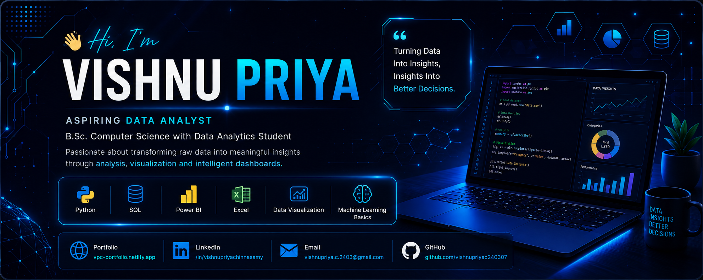

<!-- ===========================
        HEADER BANNER
=========================== -->

  

<!-- ===========================
        TYPING TEXT
=========================== -->

<h1 align="center">💙 Welcome to my GitHub Profile 💙</h1>

Passionate about turning data into meaningful insights and building impactful projects.

---

# 🚀 About Me

🎓 B.Sc. Computer Science with Data Analytics Student

📍 Coimbatore, Tamil Nadu

📊 Interested in

- Data Analytics
- Business Intelligence
- Data Visualization
- Machine Learning
- Dashboard Development

🌱 Currently Learning

- Python
- SQL
- Power BI
- Excel
- Machine Learning
- React

🎯 Career Goal

Become a Data Analyst who solves real-world business problems using data-driven solutions.

---

# 🛠 Tech Stack

## 💻 Programming Languages

## 📊 Data Analytics

## 🌐 Web Development

## ⚙️ Tools

---

# 📈 GitHub Analytics

---

---

# 📊 Contribution Graph

---

# 🏆 GitHub Trophies

---

# 🚀 Featured Projects

<table>

<tr>

<td width="50%">

<h3 align="center">📊 Smart Expense Insights</h3>

Analyze spending patterns through interactive dashboards and visual reports.

  

⚙️ <b>Tech Stack</b> 

React • JavaScript • Chart.js • Bootstrap

  

✨ <b>Features</b>

- Expense Tracking
- Interactive Charts
- Monthly Reports
- Data Visualization

  

</td>

<td width="50%">

</td>

</tr>

</table>

---

<table>

<tr>

<td width="50%">

</td>

<td width="50%">

<h3 align="center">🤖 AI Career Readiness Analyzer</h3>

AI-powered platform that evaluates career readiness and provides personalized recommendations.

  

⚙️ <b>Tech Stack</b> 

Python • Flask • HTML • CSS

  

✨ <b>Features</b>

- Resume Analysis
- Career Suggestions
- Skill Gap Detection

  

</td>

</tr>

</table>

---

<table>

<tr>

<td width="50%">

<h3 align="center">📚 AI Study Planner</h3>

Smart planner that helps students organize tasks and schedules.

  

⚙️ <b>Tech Stack</b> 

JavaScript • HTML • CSS

  

✨ <b>Features</b>

- Study Planner
- Task Scheduling
- Clean UI

  

</td>

<td width="50%">

</td>

</tr>

</table>

---

<table>

<tr>

<td width="50%">

</td>

<td width="50%">

<h3 align="center">🌐 Personal Portfolio</h3>

Modern portfolio website showcasing projects, certifications, and skills.

  

⚙️ <b>Tech Stack</b> 

React • TypeScript • Tailwind CSS • Framer Motion

  

✨ <b>Features</b>

- Responsive Design
- Project Showcase
- Certifications
- Contact Form

  

</td>

</tr>

</table>

## 📜 Certifications

🎓 Data Analytics Job Simulation — Deloitte (Forage)

🎓 Cybersecurity Analyst Job Simulation — TCS (Forage)

🎓 Cyber Job Simulation — Deloitte (Forage)

🎓 Solutions Architecture Job Simulation — AWS (Forage)

🎓 Generative AI & AI Agent

🎓 React App Development Internship

🎓 Business Analytics with Excel

🎓 Power BI Workshop

🎓 30 Days Power BI Micro Course

🎓 30 Days Python Micro Course

# 🌐 Connect With Me

---

# 💬 Quote

> **"Every dataset tells a story. My goal is to discover it."**

---

---

<h3 align="center">

💙 Thanks for visiting my profile!

⭐ If you like my work, consider giving a star to my repositories.

</h3>
